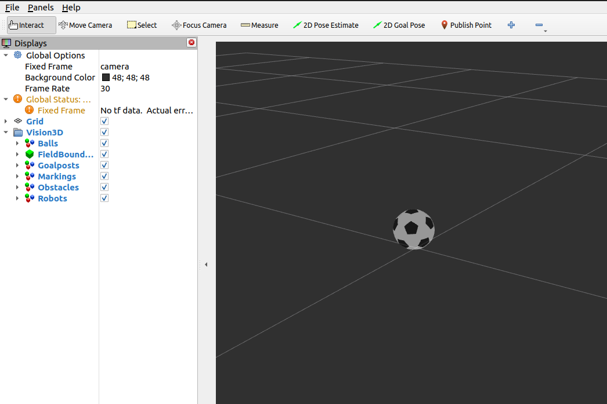

Ball
####

  Balls are visualized using a **red, spherical** marker

Properties
**********

Marker properties are utilized to visualize properties of the incoming message:

.. include:: transparency_confidence.rst

Parameters
**********

Configurable node parameters are:

* :ref:`Ball Diameter (ball_diameter) <ball_diameter>`

Example
*******

In this example, we will manually publish a ball and observe it in RViz.
Start the visualizer node:

.. code-block:: sh

  ros2 run soccer_vision_3d_rviz_markers visualizer

Set up a publisher that publishes a Ball Array message:

.. code-block:: sh

  ros2 topic pub soccer_vision_3d/balls soccer_vision_3d_msgs/msg/BallArray "
  header:
    frame_id: 'camera'
  balls:
    - center:
        x: 2.0
        y: 0.0
        z: 0.05
      confidence:
        confidence: 0.5
  "

Open RViz2 with a demo configuration:

.. code-block:: sh

  rviz2 -d $(ros2 pkg prefix --share soccer_vision_3d_rviz_markers)/rviz/demo.rviz

You should see a red ball with 50% transparency displayed in RViz:

