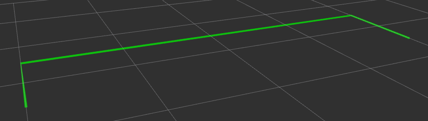
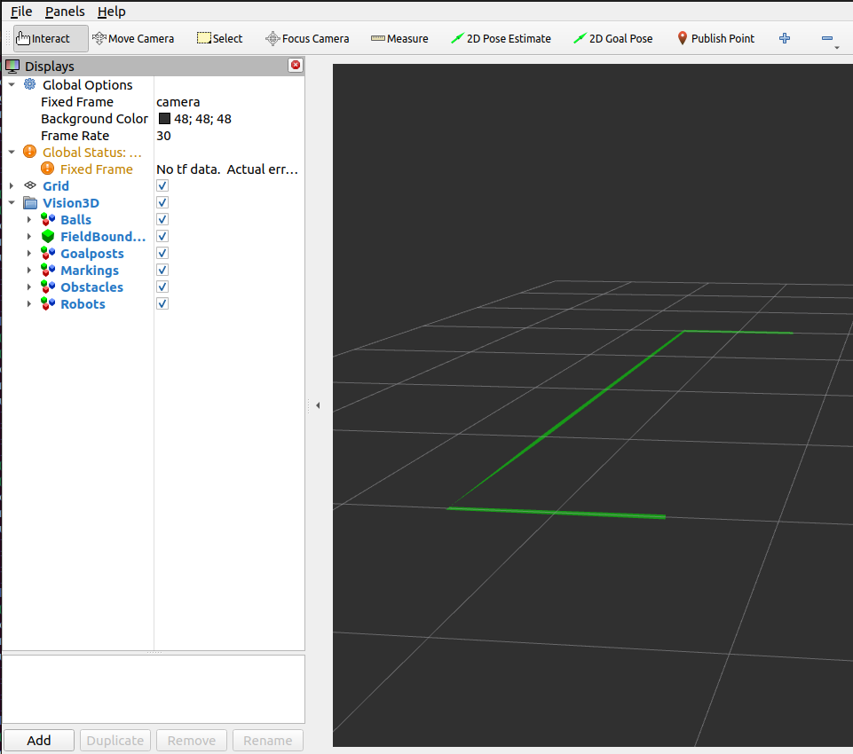

Field Boundary
##############

  Field Boundary is visualized using a **green line strip** marker

Undetected field boundary is communicated using an empty array for the points property of the incoming message.
No marker will be drawn if an empty array is received.

Properties
**********

Marker properties are utilized to visualize properties of the incoming message:

.. include:: transparency_confidence.rst

Parameters
**********

Configurable node parameters are:

* :ref:`Field Boundary Line Width (field_boundary_line_width) <field_boundary_line_width>`

Example
*******

In this example, we will manually publish a field boundary and observe it in RViz.
Start the visualizer node:

.. code-block:: sh

  ros2 run soccer_vision_3d_rviz_markers visualizer

Set up a publisher that publishes a Field Boundary message:

.. code-block:: sh

  ros2 topic pub soccer_vision_3d/field_boundary soccer_vision_3d_msgs/msg/FieldBoundary "
  header:
    frame_id: 'camera'
  points:
    - x: 1.5
      y: -2.0
      z: 0.0
    - x: 2.5
      y: -2.0
      z: 0.0
    - x: 2.5
      y: -1.0
      z: 0.0
    - x: 2.5
      y: 0.0
      z: 0.0
    - x: 2.5
      y: 1.0
      z: 0.0
    - x: 2.5
      y: 2.0
      z: 0.0
    - x: 1.5
      y: 2.0
      z: 0.0
  confidence:
    confidence: 0.5
  "

Open RViz2 with a demo configuration:

.. code-block:: sh

  rviz2 -d $(ros2 pkg prefix --share soccer_vision_3d_rviz_markers)/rviz/demo.rviz

You should see a field boundary with 50% transparency displayed in RViz:

