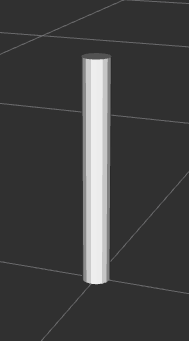
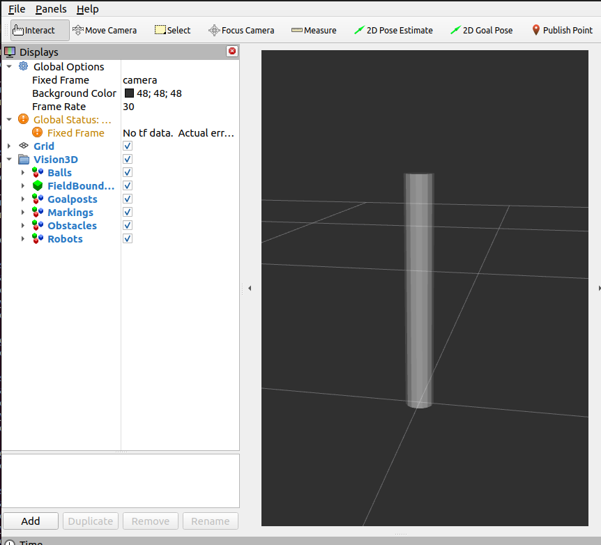

Goalpost
########

  Goalposts are visualized using a **white, cylinder** marker

Properties
**********

Marker properties are utilized to visualize properties of the incoming message:

.. include:: transparency_confidence.rst

Example
*******

In this example, we will manually publish a goalpost and observe it in RViz.
Start the visualizer node:

.. code-block:: sh

  ros2 run soccer_vision_3d_rviz_markers visualizer

Set up a publisher that publishes a Goalpost Array message:

.. code-block:: sh

  ros2 topic pub /soccer_vision_3d/goalposts soccer_vision_3d_msgs/msg/GoalpostArray "
  header:
    frame_id: 'camera'
  posts:
    - bb:
        center:
          position:
            x: 2.0
            y: 0.0
            z: 0.2
        size:
          x: 0.05
          y: 0.05
          z: 0.4
      confidence:
        confidence: 0.5
  "

Open RViz2 with a demo configuration:

.. code-block:: sh

  rviz2 -d $(ros2 pkg prefix --share soccer_vision_3d_rviz_markers)/rviz/demo.rviz

You should see a white goalpost with 50% transparency displayed in RViz:

