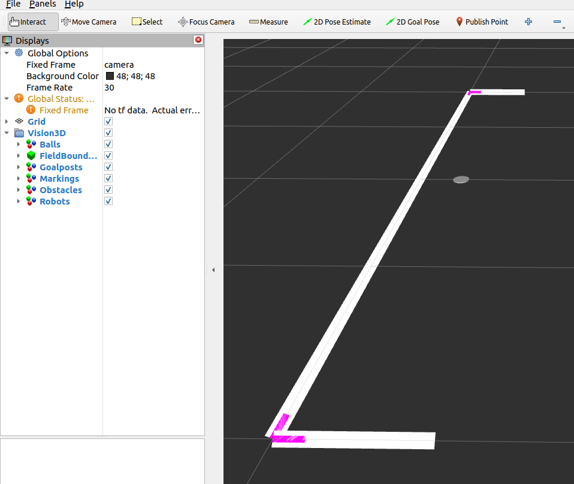

Marking
#######

.. tabs::

  .. tab:: Ellipse

    .. figure:: images/marking_ellipse.png
      :align: center

      Marking Ellipse is visualized using a **white, cylinder** marker

  .. tab:: Intersection

    .. figure:: images/marking_intersection.png
      :align: center

      Marking Intersection is visualized using a **magenta, line-list** marker

  .. tab:: Segment

    .. figure:: images/marking_segment.png
      :align: center

      Marking Segment is visualized using a **white, line-strip** marker

Properties
**********

Marker properties are utilized to visualize properties of the incoming message:

.. include:: transparency_confidence.rst

Parameters
**********

Configurable node parameters are:

* :ref:`Marking Segment Width (marking_segment_width) <marking_segment_width>`

Example
*******

In this example, we will manually publish all different types of markings and observe it in RViz.
Start the visualizer node:

.. code-block:: sh

  ros2 run soccer_vision_3d_rviz_markers visualizer

Set up a publisher that publishes a Marking Array with all different types of markings:

.. code-block:: sh

  ros2 topic pub soccer_vision_3d/markings soccer_vision_3d_msgs/msg/MarkingArray "
  header:
    frame_id: 'camera'
  ellipses:
    - diameter: 0.1
      center:
        position:
          x: 0.75
  intersections:
    - center:
        x: 1.0
        y: -2.0
      num_rays: 2
      rays:
        - x: 0.0
          y: 1.0
        - x: -1.0
          y: 0.0
    - center:
        x: 1.0
        y: 2.0
      num_rays: 2
      rays:
        - x: 0.0
          y: -1.0
        - x: -1.0
          y: 0.0
  segments:
    - start:
        x: 0.5
        y: -2.0
      end:
        x: 1.0
        y: -2.0
    - start:
        x: 1.0
        y: -2.0
      end:
        x: 1.0
        y: 2.0
    - start:
        x: 1.0
        y: 2.0
      end:
        x: 0.5
        y: 2.0
  "

Open RViz2 with a demo configuration:

.. code-block:: sh

  rviz2 -d $(ros2 pkg prefix --share soccer_vision_3d_rviz_markers)/rviz/demo.rviz

You should see the markings displayed in RViz:

