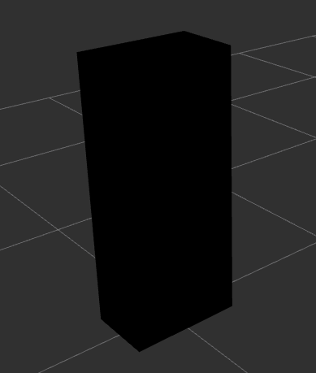
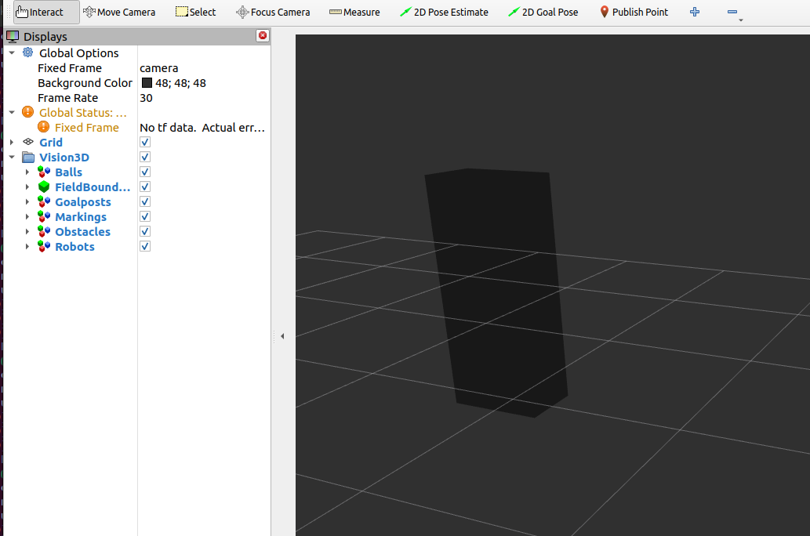

Obstacle
########

  Obstacles are visualized using a **black, cube** marker

Properties
**********

Marker properties are utilized to visualize properties of the incoming message:

.. include:: transparency_confidence.rst

Example
*******

In this example, we will manually publish an obstacle and observe it in RViz.
Start the visualizer node:

.. code-block:: sh

  ros2 run soccer_vision_3d_rviz_markers visualizer

Set up a publisher that publishes an Obstacle Array message:

.. code-block:: sh

  ros2 topic pub soccer_vision_3d/obstacles soccer_vision_3d_msgs/msg/ObstacleArray "
  header:
    frame_id: 'camera'
  obstacles:
    - bb:
        center:
          position:
            x: 2.0
            y: 0.0
            z: 0.6
        size:
          x: 0.3
          y: 0.5
          z: 1.2
      confidence:
        confidence: 0.5
  "

Open RViz2 with a demo configuration:

.. code-block:: sh

  rviz2 -d $(ros2 pkg prefix --share soccer_vision_3d_rviz_markers)/rviz/demo.rviz

You should see an obstacle with 50% transparency displayed in RViz:

