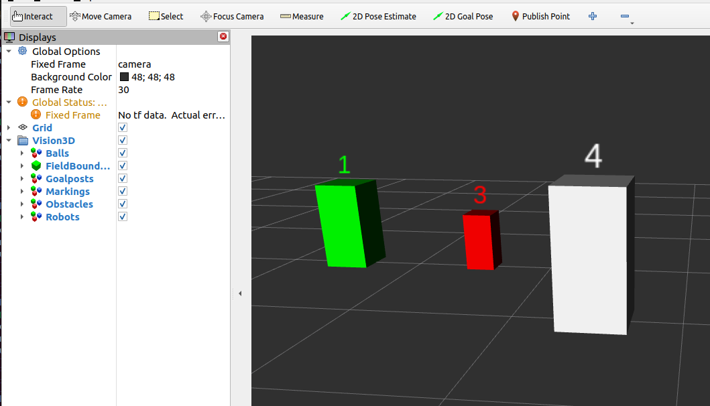

Robot
#####

.. tabs::

  .. tab:: Teammate

    .. figure:: images/robot_team_own.png
      :align: center

      Teammates are visualized using a **green, cube** marker

  .. tab:: Opponent

    .. figure:: images/robot_team_opponent.png
      :align: center

      Opponent robots are visualized using a **red, cube** marker

  .. tab:: Unknown team

    .. figure:: images/robot_team_unknown.png
      :align: center

      If a robot's team cannot be determined, visualize using a **white, cube** marker

The **player number of the robot is displayed above the cube marker**, if provided.

Properties
**********

Marker properties are utilized to visualize properties of the incoming message:

.. include:: transparency_confidence.rst

* **Color** - Team

  Team of a robot is classified as own, opponent or otherwise unknown.
  An own robot is green, opponent is red and unknown is white.

* **Number Marker** - Player Number

  Player number of a robot is displayed above the cube marker, if provided.
  If player number is unknown, the player number will not be displayed above the cube marker.

Example
*******

In this example, we will manually publish a robot array with one teammate (green) and one opponent (red) and observe it in RViz.
Start the visualizer node:

.. code-block:: sh

  ros2 run soccer_vision_3d_rviz_markers visualizer

Set up a publisher that publishes the robot array with one teammate and one opponent robot:

.. code-block:: sh

  ros2 topic pub /soccer_vision_3d/robots soccer_vision_3d_msgs/msg/RobotArray "
  header:
    frame_id: 'camera'
  robots:
    - bb:
        center:
          position:
            x: 1.0
            y: 0.5
            z: 0.3
        size:
          x: 0.3
          y: 0.3
          z: 0.6
      attributes:
        player_number: 1
        team: 1
    - bb:
        center:
          position:
            x: 1.0
            y: -0.5
            z: 0.2
        size:
          x: 0.2
          y: 0.2
          z: 0.4
      attributes:
        player_number: 3
        team: 2
  "

Open RViz2 with a demo configuration:

.. code-block:: sh

  rviz2 -d $(ros2 pkg prefix --share soccer_vision_3d_rviz_markers)/rviz/demo.rviz

You should see the robots displayed in RViz:

